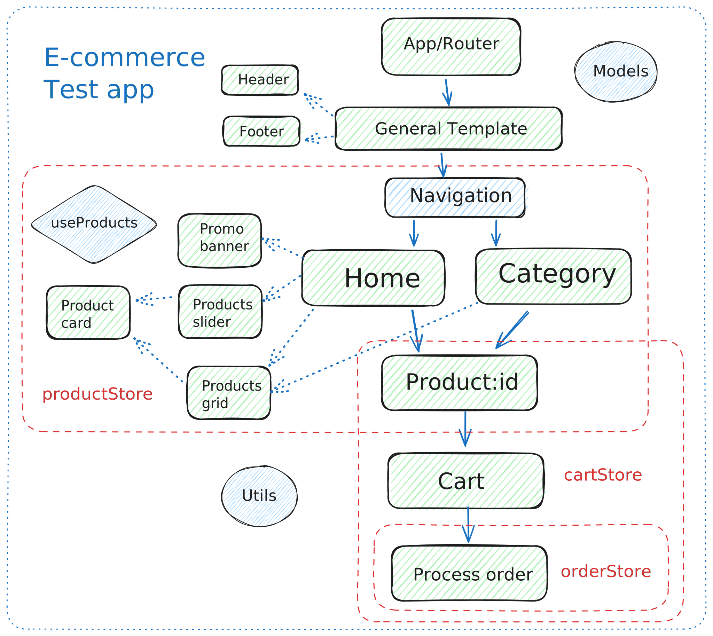

<h1>Ecommerce test site</h1>

<h3> React + TypeScript + Vite + Tailwindcss 4 + Zustand </h3>

App test de e-commerce creado con Vite, Typescript, React 18, Tailwindcss, Zustand y React Router

<h4>Instalación:</h4>

Para correr la aplicación es necesario contar con Node.js instalado (https://nodejs.org/en)

1- Clonar el repositorio

2- Desde la terminal de comandos y posicionado en la carpeta raiz del proyecto ejectar los comandos:

- npm install

- npom run dev

Esto creará un servidor local donde correrá la aplicación

<h4>Desarrollo:</h4>

Creado con VSC, con linter y estrandarización de calidad de código mediante Eslint, Prettier y el mismo tipado estático de Typescript, respetando el contrato de la API y el definido en las interfases de los modelos.

<h4>Funcionalidades:</h4>

La app carga una lista de 20 productos de la API Fake Store que se utilizan para creaar un sitio web de e-commerce.

Las bases de su composición siguen una estructura enfocada a la modularidad y a la delegación de funcionalidades en las diferentes partes/ elementos que integran la aplicación.

Mantenidendo estos patrones agiles se busca de esta forma simplificar el mantenimiento, optimizar el funcionamiento y favorecer la escalabilidad y reutilización de los diferenets recursos.

<h4>Componetización:</h4>

Se separan en dos jerarquizaciones principales, las vistas y los componentes modulares.

Las vistas, en al carpeta "views" representan la navegación de el router a través del flujo de la aplicación.
Estan contenidas en un Layout general que se implementa en todo el sitio y los estilos CSS así como su adaptabilidad en diferentes dispositivos y comportamiento responsive están implementados y controlados directamente mediante al framework utility-first de CSS Tailwindcss 4

Los componentes estan creados como módulos y usados en las diferentes secciones de la web.
Especialmente en el manejo de los productos, donde se han creado componentes de "product card", "products grid", "products slider" y "promo banner" para que sean re utilizables y escalables en caso de crecer al aplicación y ser requeridos a futuro en otras vistas o componentes de la web.

<h4>Manejo del estado (modelos, stores, actions/setters):</h4>

El "core del negocio" esta dividido en 3 stores principales: Producto, Carrito y Pedido.
Las mismas manejan el estado global para todas las vistas y componentes que lo requieran, permitiendo mostrar la información y utilizar los setters pertinentes.

Para esta implementación utilizo la librería Zustand, por su simpleza de implementación, reducido boilerplate y bundle.

<h4>Utilidades:</h4>

Persistencia de datos:

Se utiliza una utilidada para manejar local storage a nivel de usario de manera que el store pueda recuperar los productos de un carrito o un pedido en caso de que el usuario recargue o cierre el navegador

<h4>Potencialidades:</h4>

- El sitio web actualmente verifica un usuario ficticio para procesar el carrito y crear un pedido, pero se puede implementar una gestión de usuario con autentificación y verificación siguiendo la línea de trabajo realizada.

- Admite implementar testings unitarios, end-to-end o de integración

//--------------------------------------------------------////

<h5>Flowchart</h5>

